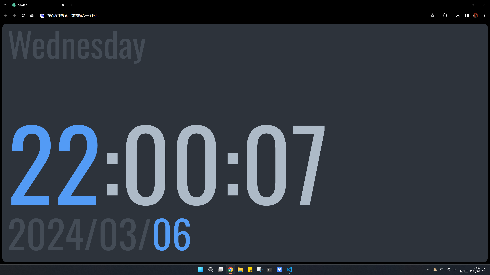

##  NewTaber（vue3 + ts）

使用百度引擎的 chrome 浏览器 newtab 页面实在一言难尽，不仅丑，而且还不能进行自定义修改，虽然可以手动删除“最近访问标签”，但却并不能彻底删除

该插件主要是覆写了 newtab 页面，美化界面的同时新增了些功能，可以用来提示一些信息，用户也可以根据个人需求自定义修改页面内容

界面效果预览：

全新样式！！！之前项目并没有使用框架，此次则基于 vue3 框架开发，大大提升开发效率，对于项目的模块扩展和后期维护也会更加容易，后续也会加入更多功能！

### 🚀 Features

- 全新的界面设计
- 日期/时间/星期
- 更多功能开发中...

### 🪛 Installation

1. 下载压缩包后解压
2. 打开浏览器 设置 > 扩展程序 > 加载已解压的扩展程序
3. 选择解压后的文件夹即可（每次修改配置文件(manifest.json)需要重新加载扩展程序）

👉 [扩展程序开发文档](https://developer.chrome.com/docs/extensions/)
